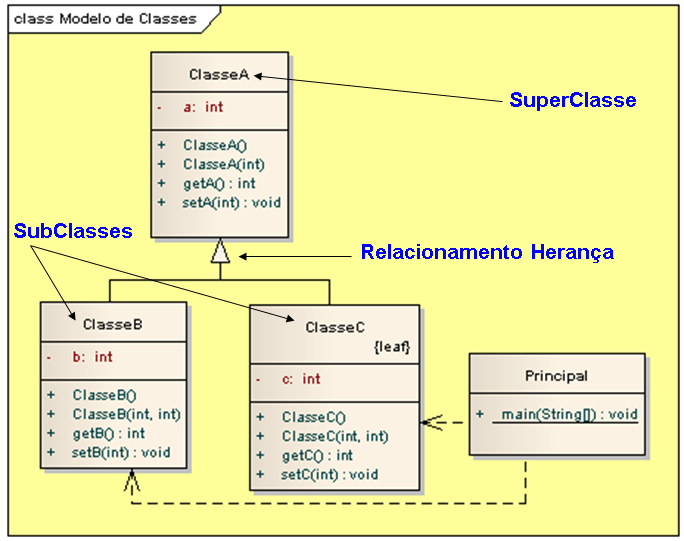

# Exemplo de implementação de relacionamento herança em Java.

## Contextualização

- Programa em Java que demostra a implementação do relacionamento herança. 
- Herança é o mecanismo pelo qual elementos mais específicos incorporam a estrutura e o comportamento de elementos mais gerais. 
- Atributos, operações e relacionamentos são herdados. 
- Herança define uma hierarquia de abstrações na qual uma subclasse herda de uma ou mais superclasses. 
    - Herança simples: a subclasse herda de uma única superclasse. 
    - Herança múltipla: a subclasse herda de duas ou mais superclasse. 
- Herança é um relacionamento “é um”ou “tipo de”. 
- O projeto foi desenvolvido no NetBeans deve ser chamado relacionamento_uml_heranca_java. 
- Utiliza o Apache Maven para a automatização da construção. 

## Diagrama de classes

## Arquivo do projeto

O arquivo Modelo.EAP é o projeto do sistema utilizando ferramanta CASE Enterprise Arquitect.

## Outros arquivos

- pom.xml - Arquivo de configuração da ferramenta de automação Maven.
- *.bat - Arquivos de lote(Batch) de console para tarefas compilar, executar, documentar, empacotar e limpar o projeto.